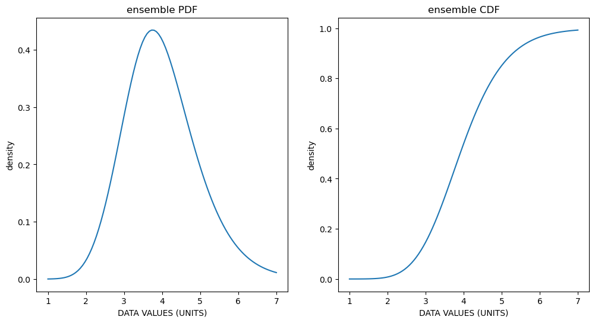

==========
Quickstart
==========

Example
-------

**Premise:** You have individual level fasting plasma glucose (FPG) data in units of mmol/L for a
population of 1000 patients.

**Role of** :code:`distrem` **package:** fit a density curve composed of a weighted sum of named
probability distributions of your choice to the histogram of your FPG values

The following code chunk generates data under the above premise, then fits a density curve of an
ensemble distribution composed of the fisk and weibull distributions to the generated data. We'll
optimize the distance between the eCDF of the data and the ensemble distribution's CDF by
minimizing the KS statistic

.. code-block:: python

    import scipy.stats
    from distrem.model import EnsembleDistribution, EnsembleFitter

    # "true" data under the above FPG premise
    true_model = EnsembleDistribution(
        named_weights={"Gamma": 0.5, "Fisk": 0.1, "InvGamma": 0.05, "Weibull": 0.3, "LogNormal": 0.05},
        mean=4,
        variance=1
    )
    fpg_data = true_model.rvs(1000)

    # fitting the fisk weibull ensemble distribution
    fsk_wbl_fitter = EnsembleFitter(
        distributions=["Fisk", "Weibull"],
        objective="KS"
    )
    weights, fsk_wbl_dist = fsk_wbl_fitter.fit(fpg_data)

    # the 1st and 2nd moments of your fitted ensemble distributions are guaranteed to match those
    # of your inputted data by solving for appropriate values of the component distributions parameters
    fpg_mean, fpg_variance = fsk_wbl_dist.ensemble_stats("mv")
    # Output: fpg_mean == 4, fpg_variance == 1

    # default plotting function for a demo visualization
    fisk_wbl_dist.plot()

    # if a bound in your ensemble is finite (0, in this case), you may change it to ensure no
    # density is assigned below/above that bound, let's change the lower bound to 2
    weights, fsk_wbl_dist = fsk_wbl_fitter.fit(fpg_data, lb=2)

    # try and see how the default plot changes!
    fisk_wbl_dist.plot()

**Please see** :ref:`Plotting` **for a practical guide on plotting with distrem.**

EnsembleDistribution
--------------------

:code:`EnsembleDistribution` is one of the main classes the user interacts with. When initializing
an :code:`EnsembleDistribution` object, the following arguments are required. Refer to :ref:`API Reference`
for more details.

* :code:`named_weights` is a dictionary where the keys are the named probability distributions in an ensemble distribution as well as their associated weghts.
* :code:`mean` of the ensmeble distribution
* :code:`variance` of the ensemble distribution
* :code:`lb` is an optional parameter specifying a lower bound under which there can be no density
* :code:`ub` is an optional parameter specifying an upper bound above which there can be no density

EnsembleDistribution Functions
------------------------------

The :code:`EnsembleDistribution` objects implements functions mimicking the :code:`pdf`, :code:`cdf`,
:code:`ppf`, :code:`rvs`, and :code:`stats` functions from Scipy's :code:`rv_continuous` class.
These functions can be used to obtain the probability density function (PDF), cumulative density
function (CDF), point percent function, random draws, and first 2 moments, respectively, of your
ensemble distribution. Refer to :ref:`API Reference` for full details.

EnsembleDistribution.plot
-------------------------

:code:`EnsembleDistribution` creates example plots of the PDF and CDF of the :code:`EnsembleDistribution`
object it's attached to.

.. code-block:: python

    import numpy as np
    from distrem.model import EnsembleDistribution

    support = np.linspace(0, 10, 100)
    ex = EnsembleDistribution({"Gamma": 0.7, "Fisk": 0.3}, 4, 1)
    ex.plot()

EnsembleFitter
--------------

:code:`EnsembleFitter` is one of the main classes the user interacts with. When initializing an
:code:`EnsembleFitter` object, the following arguments are required. Refer to :ref:`API Reference`
for more details.

* :code:`distributions` are the named probability distributions you'd like to be "considered" in the ensemble
* :code:`objective` is the objective function used when optimizing the distance between the eCDF and the fitted CDF of the ensemble distribution

EnsembleFitter.fit
------------------

After creating the :code:`EnsembleFitter` instance, we can call the :code:`fit` function to fit the
CDF of the ensemble distribution to the eCDF. Refer to :ref:`API Reference` for more details.

* :code:`data` is the array containing values for all individual-level observations (e.g. fpg values)
* :code:`lb` is an optional parameter that can "zero out" the density below the inputted parameter value
* :code:`ub` is an optional parameter that can "zero out" the density above the inputted parameter value

After fitting the model, the user will be returned the weights fitted to each of the distributions,
as well as an EnsembleDistribution object.
